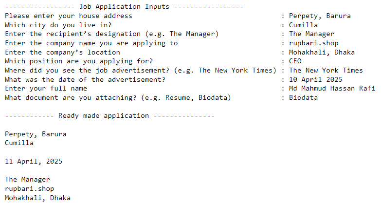
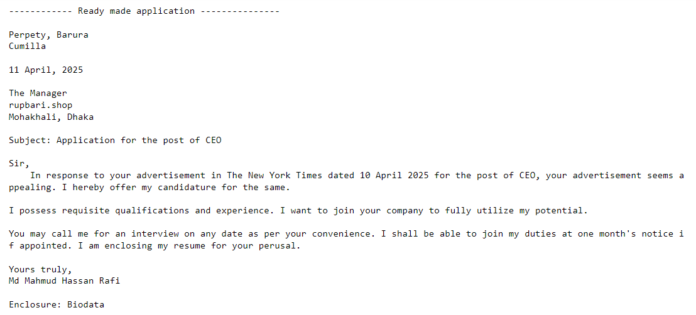

# Job Application Letter Generator (Python CLI)

This is a beginner-friendly Python project that helps you create a professional job application letter using simple user inputs. The final letter is saved as a `.txt` file on your Desktop!

## Features

- Auto-generates current date
- Formats a complete job application letter
- Takes user inputs in a friendly way
- Saves output as a `.txt` file on Desktop
- Reads and displays the saved file instantly

---

## How to Use

1. Make sure you have Python 3 installed.
2. Copy the full code into a Python file (e.g.`main.py`)
3. Run the script:
   ```bash
   python main.py

4. You’ll be prompted to enter details like:
- Your address and city
- Company details
- Job position
- Source and date of the job advertisement
- Your name and attachment (e.g. Resume)

5. After all inputs, the program:
- Creates a formatted letter
- Saves it as letter.txt on your Desktop
- Reads and shows you the letter in the terminal

---
## INPUT
Here is an example of the Job Application Letter Generator input:



---
## Output

Here is an example of the Job Application Letter Generator output:



---
##  Project Requirements
- Python 3.x
- No additional packages required

## File Save Location
The application letter is automatically saved on your Desktop as `letter.txt`

🟢 If you're using Windows, Mac, or Linux — it works cross-platform!

## License

This project is open-source and free to use under the [MIT License](LICENSE).

## Author
- Developed by **Md Mahmud Hassan Rafi**
- Feel free to modify and use for your own projects!
